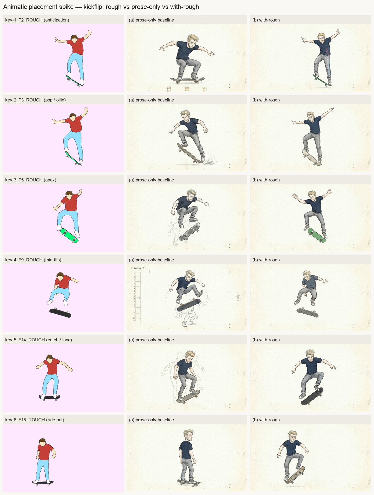
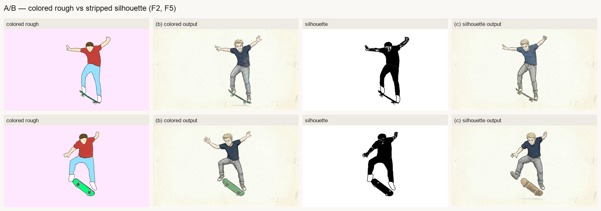

# Field Report — Animatic placement spike: the kickflip (the bet, tested before any plumbing)

**Date:** 2026-06-18
**Kickoff:** [`docs/2026-06-18-animatic-phase-kickoff.md`](../2026-06-18-animatic-phase-kickoff.md) (Step 1)
**Design of record:** [`docs/2026-06-18-animatic-phase-design.md`](../2026-06-18-animatic-phase-design.md)
**Spend:** ~**$1.0** (15 live NB2 calls — 14 spike + 1 transport smoke — at ~$0.07/image, `gemini-3.1-flash-image-preview`, Gemini-metered; well under the ~$2–3 ceiling)
**Branch:** `animatic-phase-v1` off `main` `71ad992` (isolated worktree)
**Status:** spike complete; **awaiting Sean's GO/NO-GO** (his eye is the engine-truth arbiter)

---

## The bet under test

> **A hand-drawn stick-figure placement rough actually makes the image model respect placement** —
> shoulder side, scale, leg count, left/right.

If that's false, the whole ANIMATIC stage is wasted plumbing — so per the kickoff this spike runs
**before a line of stage code.** The corpus is harder than reproducing the 2026-06-18 drift: a
**skateboard kickflip**, six keys, poses far outside Sean's sitting-and-drawing register, on roughs
that are a *competing* character (red shirt, a face, blue jeans) on a **pink ground** — so the
role-tag quarantine ("match placement, do NOT copy line/colour/character/background; identity comes
only from the anchor") is stressed at its hardest. Single character: `characters/sean-anchor/anchor.png`.

## Method

For each of the six keys, two ref slots — **anchor first (identity), rough last (composition
target)** — re-anchored every key, **no chaining** (NB2 research: re-anchor to canonical, never
chain off a generated frame). Three arms:

- **(a) prose-only baseline** — anchor only + prose naming the kickflip beat. *What does NB2 do
  with words alone?*
- **(b) with-rough** — anchor + the colored rough + the exact kickoff role-tag clause; prose stays
  generic ("Sean is performing a skateboard kickflip"), the rough carries the specific pose.
- **(c) silhouette A/B** — same as (b) but the rough stripped to a flat silhouette, on F2 + F5.

14 live calls (6 + 6 + 2). All returned `live`, `rc=0`, **zero stub fallbacks** (the harness aborts
on any stub — a stubbed spike proves nothing). Transport: the same `invoke_image_edit`
(`pipeline/agents/nb_pro_runner.py`) the production stage and Flo dispatch. Scratch harness:
`spike_animatic.py` / `spike_contact_sheets.py` (not committed to `pipeline/`).

## The evidence

**Sheet 1 — per key: rough input vs prose-only vs with-rough.**

**Sheet 2 — A/B: colored rough vs stripped silhouette (F2, F5).**

Full-res outputs (all 14): [`assets/2026-06-18-animatic-spike/outputs/`](assets/2026-06-18-animatic-spike/outputs/).

## Initial read (mine — Sean's eye decides)

1. **The rough lands placement that prose misses.** Column (b) tracks the rough's pose and airborne
   body line markedly better than the prose-only column (a) — most visibly on the *hard* beats
   (apex, mid-flip, catch/land), where prose-only keeps defaulting to a grounded skate stance.
   This is the bet's core claim, and it reads as **supported**: a visual placement reference does
   what words cannot reliably do.
2. **The quarantine held.** Every with-rough output stayed in Sean's pencil-test register on cream
   paper — **no pink ground, no red shirt, no competing face** bled through, despite the rough
   carrying all three. The role-tag clause ("don't copy its colour/character/background") did its
   job at the hardest setting. (Minor nit: one apex cell picked up a greenish board — a small palette
   echo, not a quarantine failure.)
3. **Identity held across six radically different poses.** Sean reads as the same character —
   light hair, consistent face/build — from a deep anticipation crouch through a fully airborne flip
   to an upright ride-out. The anchor-first slot carried identity through poses far outside its
   register.
4. **Colored rough ≈ silhouette — stripping looks unnecessary in v1.** On both F2 and F5 the colored
   rough and the silhouette landed the pose and held identity about equally; because the quarantine
   already suppressed the rough's palette, the colored rough needed no stripping. **Authoring-effort
   win:** v1 can ingest finished/colored roughs as-is; the silhouette step is an optional fallback,
   not a requirement. (The harder per-loop questions — establishing-frame propagation, fifth-ref
   dilution — ride to the first costed *loop* run, per the design doc.)

## Recommendation

**GO-leaning** on my read: the mechanism does the one thing the stage rests on (visual rough →
respected placement) while holding identity and quarantining the look, and it does so on a corpus
deliberately harder than the real use case. The colored-rough-works finding additionally *lowers*
the authoring cost the design flagged as the #1 risk.

**This is not the ruling.** Per the kickoff and PHILOSOPHY (engine truth), **Sean's eye is the
arbiter.** Review the two sheets:

- **GO** → I proceed to Steps 2–7: the $0 stub-green, TDD build of the opt-in ANIMATIC stage.
- **NO-GO / ambiguous** → I stop, do not build, and we rethink the conditioning path (stronger
  reference, heavier prompt-staging) before spending effort on the gate.

On GO, the full 18-frame kickflip becomes the proven-bet follow-on and a publishable museum piece
("Sean lands a kickflip, generated from his own roughs").

## Spend + fleet-ops

- ~$1.0 Gemini-metered (15 live NB2 calls), under the ~$2.5 estimate / ~$2–3 ceiling.
- Subscription billing untouched (`ANTHROPIC_API_KEY` absent); one isolated worktree off
  `main` `71ad992`; single owner; `.env` copied into the worktree (gitignored) so the key resolved.
- Both standing guards unchanged: Em verdict baseline `2af75906…`, shared voice `945af824…`.
